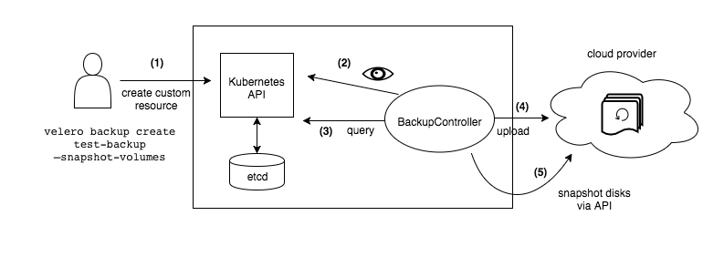

# velero
velero for kubernetes backup     

# overview
Velero (formerly Heptio Ark) gives you tools to back up and restore your Kubernetes cluster resources and persistent volumes. You can run Velero with a `cloud provider` or `on-premises`. Velero lets you:

* Take backups of your cluster and restore in case of loss.
* Migrate cluster resources to other clusters.
* Replicate your production cluster to development and testing clusters.     

Velero consists of:

* A server that runs on your cluster , deployed either by the cli or the chart
* A command-line client that runs locally (veleri-cli)


# before installation
* In this document i will deploy velero server with the official chart.    
velero backs up data to a cloud provider , s3-compatible storage services can work as well. 
I want `on-premise` backup so `minio` will be used for that case.

* Another thing to mention is the way k8s `pvc` or `pv` backups work in velero    

    1 . If your k8s cluster support `csi` you can get `volumesnapshots` which by its name you can guess what it is.     
    
    2 . If you dont have that , you will have to use `file system backup`. this way uses open-source backup tools `restic` and `kopia`.    
    this wont work with `hostPath` volumes.

*Important* : file system backup doesnt work in `minikube` for some [reason](https://github.com/vmware-tanzu/velero/issues/5018#issuecomment-1158966805) . in minikube you can only backup other object     


# installation

You can follow the [official](https://velero.io/docs/v1.11/basic-install/) installation on `velero-cli`.    
I will install the velero server with the chart    

* first you have to [install](https://helm.sh/docs/intro/install/) `helm` before deploying the chart
```
git clone https://github.com/AlirezaPourchali/velero.git

cd velero

helm install velero --namespace velero vmware-tanzu/velero --values values.yml --version 4.1.3
```
* you might need to create `velero` namespace before installing the chart.

There is also a helmfile which you have to install as well and deploy it with the following command instead

```
helmfile apply
```
* Or use the script to install with velero-cli 
```
./velero.sh
```

# deploy minio
* For minio apply the yaml file like bellow

```
kubectl apply -f examples/minio/00-minio-deployment.yaml
```

* now in `velero` namespace you have minio and velero pods


# File System Backup

* lets deploy a test pod and backup pvc

```
kubectl apply -f nginx-test.yml
```

* its a nginx pod with a pvc and a namespace creation

* change your namespace to `test-velero` , and lets put some data in there.

```
kubectl exec -it nginx-test sh
```

* inside the pods container

```
$ dd if=/dev/urandom of=/usr/share/nginx/html/test-file3.txt count=512000 bs=1024

$ ls -laSh /usr/share/nginx/html/
```
* for the backup to work , the node agent will check the annotation of a pod

* there are 2 ways opt-in , opt-out stated [here](https://velero.io/docs/v1.11/file-system-backup/)

* we use opt-in 

```
kubectl -n test-nginx  annotate pod/nginx-test backup.velero.io/backup-volumes=mystorage
```

* now to backup 

```
velero backup create test-pv-100  --include-namespaces test-nginx  --include-resources  persistentvolumeclaims,persistentvolumes --wait
```
* for this to work you need permissions to a lot of objects and resources

* you can debug it with `velero backup describe` or `velero backup logs` commands 

* you can check your minio to see if the backup is done successfully or not.

* install [minio-client](https://min.io/docs/minio/linux/reference/minio-mc.html)

* change to velero namespace

```
kubectl port-forward <minio-pod> 9000:9000

```

* in another shell

```
mc ls local/velero2/backups/test-pv-100 
```
* check the volume size . if its not about 500 megabytes there is something wrong

# restoring 

* delete the namespace , and run the following 
```
velero restore create --from-backup test-pv-100 
```


# to do
# csi 
# volumesnapshot
